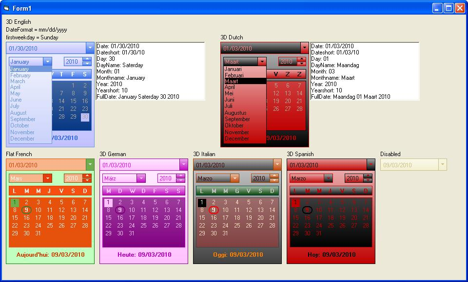



## DmDatePicker

### Description

Multilingual datepicker.

Colors for each item in the control can be set.

3D or flat style.

Updates:

Refreshing date when clicked in monthlist

Selection formats dd/mm/yyyy mm/dd/yyyy added

Selection for firstweekday added
 
### More Info
 
Returns, date in dd/mm/yyyy format, daynumber, dayname, monthnumber, monthname, long year, short year, full date with dayname and monthname.

             |
---                |---
**Submitted On**   |2010-02-18 12:38:04
**By**             |[Frank Donckers](https://github.com/Planet-Source-Code/PSCIndex/blob/master/ByAuthor/frank-donckers.md)
**Level**          |Advanced
**User Rating**    |5.0 (15 globes from 3 users)
**Compatibility**  |VB 6\.0
**Category**       |[Miscellaneous](https://github.com/Planet-Source-Code/PSCIndex/blob/master/ByCategory/miscellaneous__1-1.md)
**World**          |[Visual Basic](https://github.com/Planet-Source-Code/PSCIndex/blob/master/ByWorld/visual-basic.md)
**Archive File**   |[DmDatePick217664392010\.zip](https://github.com/Planet-Source-Code/frank-donckers-dmdatepicker__1-72963/archive/master.zip)

